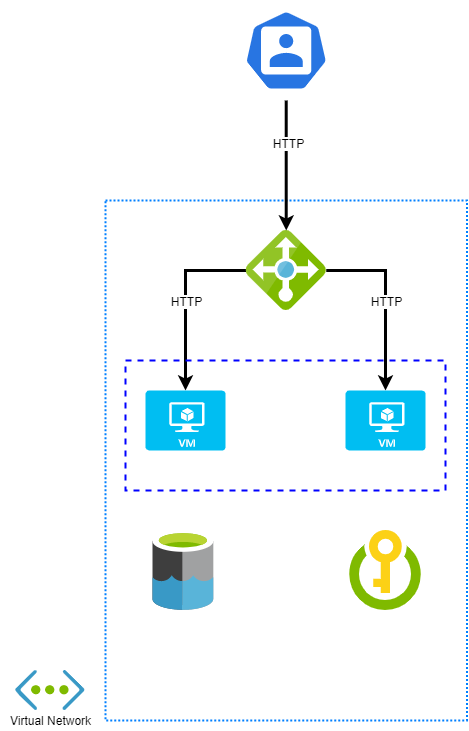

# Sentia - Assessment 1
******************************************************************************************
## Road to the solution

### The Beginning
Full disclosure, I had never touched Azure Resource Manager (ARM) before beginning this assessment. I **hope** this isn't too obvious...

To start off this project, I created a little diagram to visualize what needed to be done and how it all connects together:

### Assumptions
I found the assessment's requirements relatively straightforward, the only assumption I made was the following:
* Virtual Machines had to be created with a loadbalancer instead of Azure's Web App Service

### ARM Templates
From there, I started looking at what other people had created and begun piecing together parts of their templates to get all the required resources deployed.

Once I got the deployment template finalised, I started creating a little Python web app (with Flask and Gunicorn) in order to utilise the Data Lake Gen2 Storage. By now I was pretty comfortable with Azure's Resource Management templates and what could be done with them (a lot).

One thing which ARM doesn't really do - in my experience - is configure virtual machines/deploy code once it is up and running. Which is when I started looking into Ansible.

### Ansible
I created a simple playbook which grabs my GitHub repo and configures/deploys my web app to the Azure Resource Group dynamically. This allowed me to scale the web app nearly infinitely horizontally (I was only able to test it up to 4 VMs due to quota limits on the Azure free trial account).

### Final thoughts
I enjoyed this project/assessment a lot more than I thought I would. Being able to spin up a complete infrastructure with a few lines of Yaml was extremely fun and I'm keen to explore more.

There a few things which I'd like to look further into in the future including:
* Creating seperate template files instead of one huge template to improve modularity and reusability
* Further integrate Ansible with Azure to configure the infrastructure without manual intervention (i.e. setting environment variables on the host)
* Using Azure Pipelines/DevOps Projects to automate deployment and configuration management
* Deploying code within Docker containers to lock down configuration (and also allow deployment to Kubernetes)

### Time Log
|Research and Testing|Implementation|
|:------------------:|:------------:|
|10 Hours|20 Hours|